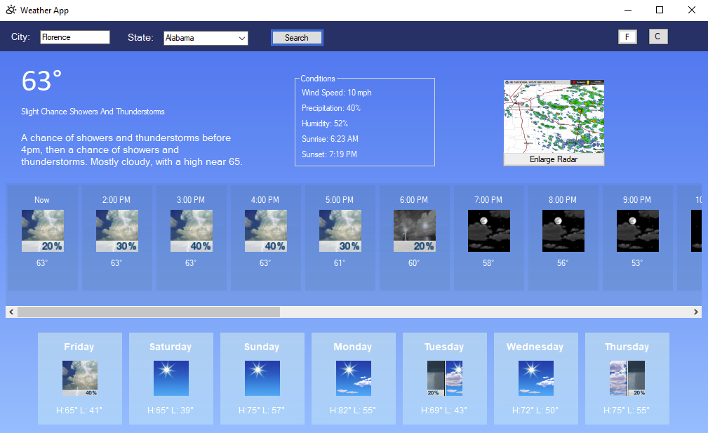
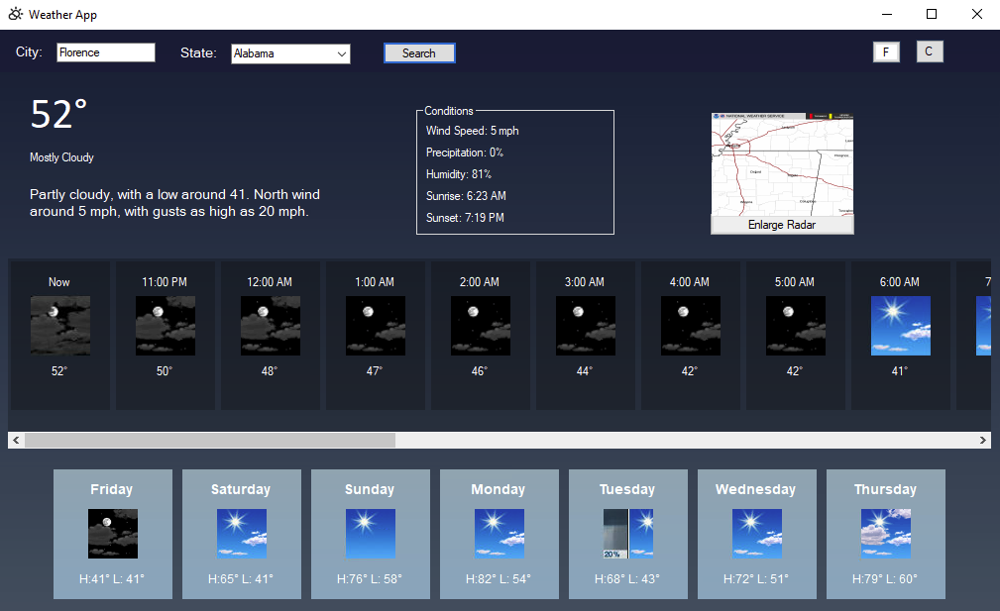

# Weather App

A **desktop weather application** built with C# and .NET that provides **real-time weather forecasts, alerts, and radar images** using the **OpenWeatherMap API** and the **National Weather Service (NWS) API**.

---

## Preview

  
  

---

## Features

- **Current Weather**
  - Displays temperature, humidity, wind speed, and weather conditions.
  - Shows sunrise and sunset times.
  - Includes a weather icon for quick visual reference.

- **Hourly Forecast**
  - Displays weather conditions for the next 24 hours.
  - Shows temperature, short forecast, and weather icons.

- **Daily Forecast**
  - Provides a 7-day forecast with high and low temperatures.
  - Displays weather conditions and icons for each day.

- **Weather Alerts**
  - Fetches and displays active weather alerts for the selected location.
  - Shows a summary of alerts and allows users to view detailed information.

- **Radar Images**
  - Displays real-time radar images for the selected location.
  - Allows users to enlarge the radar image for better visibility.

- **Temperature Unit Conversion**
  - Supports switching between Fahrenheit and Celsius.

- **Dynamic Background**
  - Changes the background gradient based on the time of day (daytime or nighttime).

---

## How to Use

1. **Clone the Repository**  
   ```bash
   git clone https://github.com/yourusername/Weather-App.git

2. **Launch the Application:** 
   - Open Weather App.sln in Visual Studio

3. **Enter Location:**
   - In the application window, enter a city name in the "City" text box. 
   - Select a state from the dropdown menu.

4. **Fetch Weather Data:**
   - Click the "Search" button to fetch and display weather data for the selected location.

5. **View Weather Information:**
   - The current weather, including temperature, humidity, wind speed, precipitation, and weather conditions, will be displayed. 
   - The hourly forecast for the next 24 hours will be shown in a horizontal scrollable panel. 
   - The 7-day daily forecast will be displayed below the hourly forecast.

6. **View Weather Alerts:**
   - If there are active weather alerts for the selected location, a message box will pop up with a summary of the alerts. 
   - Click "OK" to view detailed information about the first alert in a new window, otherwise click "cancel" to exit.

7. **View Radar Images:**
   - A radar image for the selected location will be displayed above the hourly forecast. 
   - Click the "View Radar" button to view the radar image in a larger window.

8. **Switch Temperature Units:**
   - Use the "Celsius" and "Fahrenheit" buttons, on the top right, to switch between temperature units.

---

### API Keys

The app requires an OpenWeatherMap API key. If the default key reaches its limit:

1. Sign up for a free API key at [OpenWeatherMap](https://openweathermap.org/home/sign_up).  
2. Update the application to use your new API key. (Replace the placeholder API key in the WeatherService.cs file with your new API key.)